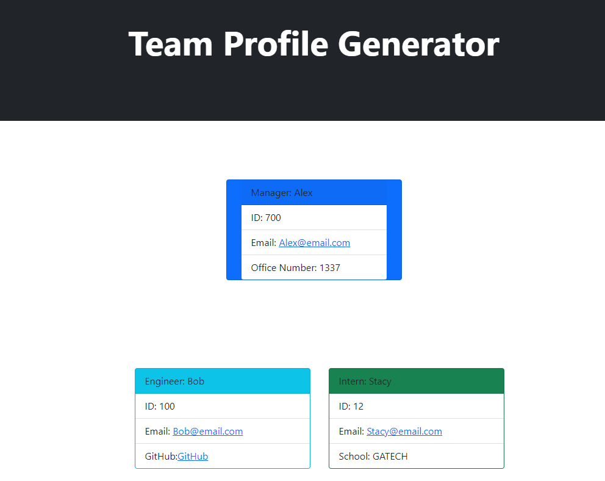
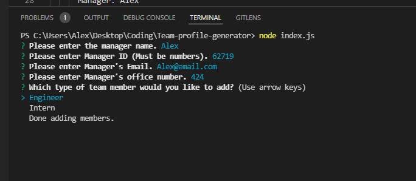

# Team-profile-generator

## Description

An application that uses Nodejs to generate a quick HTML file with the manager's info and the team consisting of engineers and/or interns. Each member of the team will generate their own card.

## Link to youtube video for quick guide

Use the following link of a quick demonstration on how to run the file:
https://youtu.be/Er5-1U43I0Y

## Example of the generated html



## How to use

-In the integrated terminal, make sure to install all packages with "npm install"

-Once installation is complete, run the code using "node index.js"

-Prompts will start to run and answer all the questions needed.



-After filling out the manager information you can add either an Intern or Engineer to your team. Once you are done and select the "Done adding members" option. It will generate an index.html file under the "./dist/" directory.

## Tests

To run the test command, run the following command:

```
npm test
```
